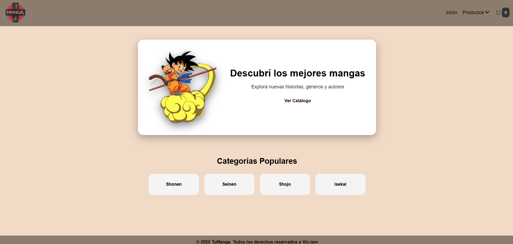

# TuManga

Este proyecto fue realizado para el curso de coderhouse

### Instalacion

1. Clonar el repsitorio.
2. Moverse a la carpeta creada con el comnado `cd my-app`.
3. Ejecutar el comando `npm install` para instalar las depedencias y crear la carpeta `node_modules`.
4. Ejecute el comando `npm run dev` para levantar la app en un entorno local.

> Es necesario contar con la version de Node v24.12.0 instalado

### Version Host 

Si desea ver el proyecto online puede ingresar al link: [my app]()

### Librerias instaladas

- [React Icons](https://react-icons.github.io/react-icons/): libreia de iconos.
- [React Router Dom](https://reactrouter.com/): Utilizado para implementar la navegacion por rutas
- [Firebase](https://firebase.google.com/): Ulitizado para base de datos
- [React Hook Form](https://react-hook-form.com/): Utilizado para manejar formularios con validaciones y control de estado
- [React Spinner](https://www.davidhu.io/react-spinners/): Utilizado para la coleccion de componentes de carga animados
- [SweetAlert2](https://sweetalert2.github.io/): Utilizado para monstrar alertas perzonalizadas